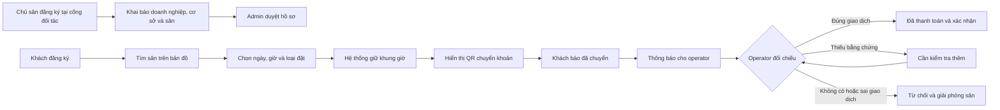

# Luồng nghiệp vụ toàn bộ hệ thống

## 1. Tổng quan

Hệ thống có ba nhóm người sử dụng và bốn địa chỉ truy cập:

- **Khách thuê sân:** tự đăng ký, tìm sân, xem lịch trống, đặt vãng lai hoặc cố định, chuyển khoản và theo dõi xác nhận.
- **Chủ sân/nhân sự vận hành:** chủ sân tự đăng ký tại cổng đối tác và khai báo sân; nhân viên được chủ sân hoặc Admin mời vào đúng doanh nghiệp/cơ sở; chỉ được kiểm tra chuyển khoản và xác nhận booking trong phạm vi được cấp.
- **Admin:** duyệt hồ sơ doanh nghiệp/cơ sở, quản trị quyền truy cập, xử lý khiếu nại và giám sát hệ thống.

| Cổng | Địa chỉ | Phạm vi |
|---|---|---|
| Cổng khách thuê | `tenmien.vn` | Tìm sân, đặt sân và theo dõi booking |
| Cổng đối tác | `partner.tenmien.vn` | Quản lý cơ sở, sân, lịch và thanh toán |
| Cổng quản trị | `admin.tenmien.vn` | Quản trị toàn nền tảng |
| API dùng chung | `api.tenmien.vn` | Phục vụ cả ba cổng trên |

Mô hình tài sản thống nhất là `Doanh nghiệp → Cơ sở/Chi nhánh → Sân`. Một doanh nghiệp có thể có nhiều cơ sở; một cơ sở có nhiều sân cho thuê theo giờ.

## 2. Chủ sân tự đăng ký sân và Admin duyệt

1. Chủ sân mở `partner.tenmien.vn`, chọn **Đăng ký đối tác** và xác minh email/số điện thoại.
2. Hệ thống tạo tài khoản `VENUE_OPERATOR` ở trạng thái `PENDING_ONBOARDING`; client không được tự truyền hoặc thay đổi `account_type`.
3. Chủ sân khai báo doanh nghiệp, thông tin liên hệ/pháp lý và được gán membership `OWNER/PENDING` vào chính doanh nghiệp vừa tạo.
4. Chủ sân tạo một hoặc nhiều cơ sở ở trạng thái `DRAFT`, nhập địa chỉ, vị trí bản đồ, ảnh, giờ mở cửa, tiện ích và tài khoản ngân hàng/QR nhận tiền.
5. Chủ sân tạo các sân thuộc từng cơ sở, cấu hình giá và lịch hoạt động.
6. Chủ sân kiểm tra hồ sơ rồi chọn **Gửi duyệt**. Doanh nghiệp và cơ sở chuyển sang `PENDING_APPROVAL` và bị khóa các trường quan trọng trong lúc duyệt.
7. Admin nhận thông báo, kiểm tra hồ sơ và chọn một trong hai kết quả:
   - **Yêu cầu chỉnh sửa:** hồ sơ quay về `DRAFT`, kèm lý do và danh sách nội dung cần bổ sung.
   - **Phê duyệt:** doanh nghiệp và owner membership chuyển sang `ACTIVE`, cơ sở chuyển sang `PUBLISHED`, các sân hợp lệ chuyển sang `ACTIVE`.
8. Chỉ cơ sở `PUBLISHED` và sân `ACTIVE` mới xuất hiện tại `tenmien.vn` và nhận booking.
9. Sau khi được duyệt, chủ sân có thể mời nhân viên bằng link một lần và giới hạn quyền theo toàn doanh nghiệp hoặc từng cơ sở.

Admin không cần nhập hộ thông tin sân. Admin vẫn có quyền từ chối, tạm khóa doanh nghiệp/cơ sở, thu hồi membership và yêu cầu duyệt lại khi các thông tin quan trọng như địa chỉ, tài khoản nhận tiền hoặc chủ sở hữu thay đổi.

## 3. Khách đăng ký và đăng nhập

1. Khách đăng ký bằng email hoặc số điện thoại.
2. Hệ thống xác minh OTP/link, chuẩn hóa email/phone và hash mật khẩu.
3. Public registration luôn tạo `account_type = CUSTOMER`.
4. Khi đăng nhập, hệ thống cấp access token ngắn hạn và refresh token xoay vòng.
5. Khách bị khóa sẽ không thể tạo booking hoặc tiếp tục phiên đăng nhập mới.

## 4. Tìm sân gần nhất

1. Khách cho phép trình duyệt lấy vị trí hoặc tự nhập khu vực.
2. Google Maps hỗ trợ hiển thị bản đồ và nhập/geocode địa chỉ.
3. React gửi tọa độ tạm thời và bán kính đến API nearby.
4. PostgreSQL/PostGIS dùng `ST_DWithin` để lọc và `ST_Distance` để sắp xếp cơ sở gần nhất.
5. Hệ thống chỉ trả cơ sở đã publish và đủ điều kiện hiển thị công khai; bước nearby không lọc theo booking hoặc bảo trì của một khung giờ.
6. Frontend hiển thị bản đồ và danh sách cơ sở gần, kèm thông tin cơ bản và khoảng cách.
7. Khách chọn sân để mở trang chi tiết, sau đó dùng chung luồng đặt sân: chọn sân cụ thể, **Vãng lai** hoặc **Cố định**, chọn ngày giờ và các ca cần đặt. Lịch trống và giá được kiểm tra trong luồng này; kết quả nearby không giữ chỗ.

Nếu khách từ chối quyền vị trí, hệ thống vẫn cho tìm theo tỉnh/thành, quận/huyện hoặc địa chỉ. Tọa độ chính xác của khách không được lưu lâu dài.

## 5. Chọn ngày trong tương lai

- Khách chọn local date theo múi giờ của venue.
- Backend chuyển khung giờ đó sang UTC trước khi kiểm tra và lưu.
- Venue cấu hình booking horizon, ví dụ cho phép đặt trước tối đa 30 hoặc 60 ngày.
- Không cho đặt ngoài giờ mở cửa, trong thời gian bảo trì hoặc trong quá khứ.
- Giá được tính lại tại thời điểm tạo booking và được snapshot để thay đổi bảng giá sau này không ảnh hưởng booking cũ.
- Chủ sân tự đặt giá cho từng sân cụ thể thuộc doanh nghiệp của mình; mỗi sân và mỗi khung giờ có thể có giá khác nhau. Giá được cấu hình theo ca 30 phút, có thể phân biệt ngày trong tuần và kỳ áp dụng. Booking đi qua nhiều khung giá được tính bằng tổng giá từng ca; lịch cố định tính theo bảng giá áp dụng cho từng buổi.
- Chỉ owner có membership active tại doanh nghiệp sở hữu sân mới được sửa bảng giá của sân đó. Ca chưa có giá hợp lệ chưa được phép đặt; các quy tắc giá chồng nhau phải có thứ tự ưu tiên rõ ràng.

## 6. Đặt sân vãng lai

Khách thực hiện cả hai loại đặt ngay trên trang chi tiết sân. Lịch của sân được chia thành các ca 30 phút; ví dụ 18:00-20:00 gồm bốn ca: 18:00, 18:30, 19:00 và 19:30.

1. Khách chọn chế độ **Vãng lai**, một ngày tương lai và một hoặc nhiều ca 30 phút liên tiếp.
2. Đây là kiểu đặt tự do: khách tự chọn giờ bắt đầu và thời lượng theo nhu cầu, tối thiểu một ca 30 phút.
3. React gửi `startsAt`, `endsAt`, `quoteId` và `Idempotency-Key`; cả hai mốc thời gian phải nằm trên phút `00` hoặc `30`.
4. Backend mở transaction, tính lại giá theo số ca và insert một `court_allocation` bao phủ toàn bộ khoảng thời gian.
5. PostgreSQL exclusion constraint kiểm tra khoảng thời gian có giao nhau hay không.
6. Nếu trống, hệ thống tạo một booking `CASUAL` ở trạng thái `AWAITING_TRANSFER`.
7. Nếu có người vừa đặt trước dù chỉ một ca, transaction thất bại và API trả `409 SLOT_UNAVAILABLE`.
8. Booking có `payment_deadline`; các ca đã chọn được giữ cho khách trong thời gian này.

## 7. Đặt sân cố định

Đặt cố định cũng bắt đầu từ trang chi tiết sân, nhưng dùng để giữ cùng một khung giờ lặp hàng tuần. Ví dụ: thứ Ba, 18:00-20:00, từ ngày 01/10 đến 30/11.

1. Khách chọn chế độ **Cố định**, một thứ trong tuần, ngày bắt đầu/kết thúc và một khung giờ gồm các ca 30 phút liên tiếp.
2. Mỗi buổi cố định phải kéo dài tối thiểu 2 giờ, tương ứng ít nhất 4 ca.
3. Khoảng thuê phải từ 1 tháng trở lên: `ends_on` không được sớm hơn ngày `starts_on` cộng 1 tháng và không vượt booking horizon.
4. Quote API sinh toàn bộ occurrence cùng thứ, cùng sân và cùng khung giờ theo múi giờ của cơ sở.
5. Backend kiểm tra từng occurrence với booking và maintenance hiện có.
6. Nếu có xung đột, API trả danh sách ngày/ca không khả dụng để khách chọn lịch khác.
7. Nếu tất cả đều trống, Create API tạo `booking_series`, các booking occurrence và allocation trong một transaction.
8. Ngay khi tạo series, toàn bộ occurrence trong khoảng đã chọn được giữ; khách khác không thể chọn ca giao nhau. Nếu quá `payment_deadline` mà khách chưa báo chuyển khoản, toàn bộ allocation của series được giải phóng.
9. Mỗi occurrence là một booking thật để quản lý xác nhận thanh toán, doanh thu và lịch sân.
10. Nếu một insert bị xung đột, toàn bộ transaction rollback; không âm thầm bỏ qua một buổi.

Payment plan của lịch cố định cần chốt. Khuyến nghị MVP thu theo tháng để cân bằng dòng tiền và trải nghiệm khách hàng.

## 8. Chuyển khoản bằng QR

Sau khi booking hoặc series được tạo, ứng dụng hiển thị:

- QR nhận tiền do chủ sân tải lên và cấu hình cho venue của booking.
- Tên ngân hàng và tên chủ tài khoản.
- Số tài khoản đã che bớt khi phù hợp.
- Số tiền cần chuyển.
- Nội dung chuyển khoản chứa `booking_no` hoặc `series_no` duy nhất.
- Đồng hồ đếm ngược đến `payment_deadline`.

Chủ sân phải cung cấp QR nhận tiền hợp lệ trước khi cơ sở nhận booking. Khi tạo booking, hệ thống lưu snapshot QR và thông tin nhận tiền để việc chủ sân thay QR sau đó không thay đổi hướng dẫn thanh toán của booking đã tạo.

Khách chuyển khoản bằng ứng dụng ngân hàng, sau đó bấm **Đã chuyển khoản**, nhập mã giao dịch và có thể tải ảnh biên lai. Việc bấm nút này chưa có nghĩa là đã thanh toán thành công; payment chuyển sang `TRANSFER_REPORTED` và booking sang `AWAITING_OWNER_CONFIRMATION`, hiển thị **Chờ xác nhận**. Với luồng xác nhận thủ công này, hệ thống ghi nhận việc chuyển tiền khi khách bấm nút, không tự biết giao dịch đã hoàn tất trong ứng dụng ngân hàng.

## 9. Thông báo cho chủ sân

1. Transaction cập nhật booking đồng thời ghi một `outbox_message`.
2. Background Worker lấy message bằng `FOR UPDATE SKIP LOCKED`.
3. Worker tạo notification trong hệ thống gửi đến chủ sân của booking; nhân viên có quyền xác nhận tại cơ sở có thể nhận thêm theo phân quyền. Thông báo gồm mã booking, khách thuê, sân, khung giờ, số tiền, thời điểm báo chuyển và liên kết mở chi tiết để xác nhận. Email/SMS/Zalo được gửi thêm theo cấu hình.
4. Operator portal nhận cập nhật realtime qua SignalR hoặc polling.
5. Nếu gửi thất bại, worker retry có backoff; quá số lần quy định sẽ phát cảnh báo.

Không gọi dịch vụ notification trực tiếp bên trong transaction booking, vì lỗi mạng không được phép làm mất trạng thái thanh toán.

## 10. Chủ sân xác nhận chuyển khoản

Operator mở danh sách **Chờ xác nhận** và xem:

- Mã booking/series.
- Khách thuê và khung giờ.
- Số tiền phải trả.
- Mã giao dịch và ảnh biên lai nếu có.
- Thời điểm khách báo đã chuyển.

Operator đối chiếu tài khoản ngân hàng rồi chọn:

- **Xác nhận:** payment thành `PAID`, booking thành `CONFIRMED`, lưu `confirmed_by` và `confirmed_at`; cả cổng khách và cổng chủ sân hiển thị **Đã xác nhận**, đồng thời thông báo kết quả cho khách.
- **Cần kiểm tra:** payment thành `NEEDS_REVIEW`, khách được yêu cầu bổ sung bằng chứng.
- **Từ chối:** bắt buộc nhập lý do; khi từ chối cuối cùng, booking thành `PAYMENT_REJECTED` và allocation được giải phóng.

Mọi thao tác phải kiểm tra active membership, idempotency và optimistic concurrency. Operator của doanh nghiệp/cơ sở A không thể xác nhận booking của cơ sở B nếu không được cấp quyền.

## 11. Hết hạn và xử lý tranh chấp

- Nếu khách chưa báo chuyển khoản khi hết `payment_deadline`, Worker chuyển booking sang `EXPIRED` và giải phóng court.
- Booking đã `AWAITING_OWNER_CONFIRMATION` không được tự động giải phóng chỉ vì operator xác nhận chậm; hệ thống phải cảnh báo quá SLA.
- Nếu khách đã chuyển nhưng quên bấm báo và slot đã được bán cho người khác, Admin mở dispute và xử lý bồi hoàn thủ công.
- Khách không có API hoặc nút hủy/đổi lịch.

## 12. Sau khi xác nhận thanh toán

1. Booking hiển thị **Đã xác nhận** (`CONFIRMED`); luồng giao dịch trên hệ thống kết thúc tại đây.
2. Khách chỉ cần đến đúng sân, đúng khung giờ đã đặt và chơi.
3. Mọi vấn đề sau xác nhận thanh toán được giải quyết trực tiếp với nhân viên tại sân.
4. Không yêu cầu check-in/check-out; không có trạng thái đã đến sân, vắng mặt hoặc hoàn thành. Booking giữ `CONFIRMED` sau giờ chơi, lịch sử vẫn hiển thị ngày giờ đã đặt.
5. Allocation giữ khoảng thời gian đã đặt để chống trùng lịch; các khung giờ sau đó được xét theo thời gian, không phụ thuộc thao tác kết thúc booking.
6. Đánh giá sân nếu triển khai là tùy chọn, không phải bước tiếp theo bắt buộc: cho phép một đánh giá với booking `CONFIRMED` đã qua `ends_at`.

## 13. Luồng quản trị và vận hành

Admin có thể:

- Tạo/sửa/suspend doanh nghiệp, cơ sở và sân; duyệt nội dung trước khi publish.
- Mời, gán hoặc thu hồi operator.
- Xử lý tranh chấp thanh toán chưa được xác nhận; vấn đề sau xác nhận do khách làm việc trực tiếp với nhân viên tại sân.
- Tra cứu audit log.
- Theo dõi booking chờ xác nhận quá SLA, worker lỗi, thanh toán lệch và backup.

Operator có thể:

- Xem booking của doanh nghiệp/cơ sở được gán.
- Xác nhận/từ chối chuyển khoản.
- Quản lý giờ mở cửa, QR, ảnh và maintenance nếu được cấp permission; cấu hình giá từng sân thuộc quyền của owner doanh nghiệp sở hữu sân.
- Chủ doanh nghiệp có thể tạo cơ sở/sân nháp để gửi Admin duyệt.
- Xem doanh thu và booking trong phạm vi được cấp.

## 14. Những bất biến phải giữ

1. Không bao giờ có hai allocation active giao nhau trên cùng một court.
2. Customer không thể tự biến mình thành operator hoặc admin.
3. Operator không thể truy cập doanh nghiệp/cơ sở ngoài membership.
4. Payment chỉ thành `PAID` sau thao tác xác nhận có audit của operator/Admin.
5. Retry không được tạo booking, notification hoặc xác nhận thanh toán trùng.
6. Giá, chính sách và lịch được snapshot tại thời điểm booking.
7. PostgreSQL là nguồn dữ liệu chuẩn; MongoDB/log/cache không quyết định quyền sở hữu slot.
