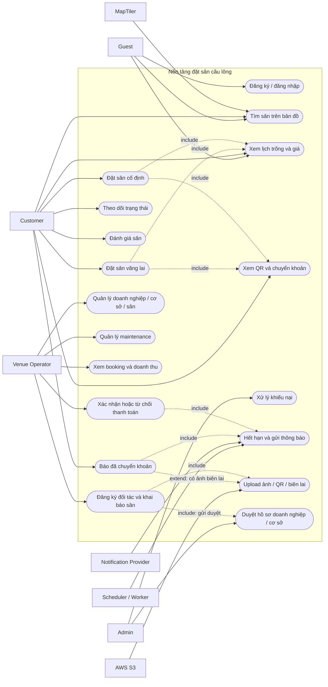

# Actor, Use Case và phân rã nghiệp vụ

## Actor

| Actor | Trách nhiệm |
|---|---|
| Guest | Tìm/xem sân, xem lịch trống, đăng ký và đăng nhập |
| Customer | Đặt vãng lai/cố định, chuyển khoản, theo dõi xác nhận; đánh giá tùy chọn |
| Venue Operator | Chủ sân tự đăng ký/khai báo sân; vận hành phạm vi được duyệt và mời nhân viên khi có quyền |
| Admin | Duyệt doanh nghiệp/cơ sở, quản trị operator, xử lý khiếu nại và audit |
| Scheduler/Worker | Hết hạn booking chưa báo chuyển khoản, gửi notification và retry |
| Notification Provider | Email, SMS, Zalo hoặc push notification |
| MapTiler | Hiển thị bản đồ, hỗ trợ nhập/geocode địa chỉ và marker |
| AWS S3 | Lưu ảnh sân, QR và bằng chứng chuyển khoản |

Mỗi tài khoản có một `account_type`: `CUSTOMER`, `VENUE_OPERATOR` hoặc `ADMIN`. Chủ sân tự đăng ký tại cổng đối tác và chỉ có quyền trên doanh nghiệp nháp do mình tạo; nhân viên tham gia bằng lời mời. Membership cấp doanh nghiệp cho phép quản lý toàn bộ chi nhánh; quyền cấp cơ sở chỉ cho phép thao tác trên các cơ sở được chỉ định.

## Use Case Diagram

Mermaid không có cú pháp UML Use Case native nên sơ đồ dùng flowchart; node hình oval đại diện cho use case.

Luồng booking kết thúc ở **Đã xác nhận**. Khách đến sân chơi; mọi vấn đề sau xác nhận thanh toán được xử lý trực tiếp với nhân viên tại sân. UC-09 đã bỏ; giữ nguyên mã các use case còn lại.

## Danh mục Use Case

| ID | Use Case | Actor chính | Kết quả |
|---|---|---|---|
| UC-01 | Đăng ký và đăng nhập | Guest/Customer | Tạo phiên đăng nhập an toàn |
| UC-02 | Tìm sân gần nhất | Guest/Customer | Danh sách và marker theo khoảng cách |
| UC-03 | Xem availability và giá | Guest/Customer | Các ca 30 phút còn trống và quote có thời hạn |
| UC-04 | Đặt sân vãng lai | Customer | Một booking gồm các ca 30 phút liên tiếp |
| UC-05 | Đặt sân cố định | Customer | Một khung giờ lặp hàng tuần trong ít nhất 1 tháng |
| UC-06 | Xem QR chuyển khoản | Customer | QR, số tiền, nội dung và deadline |
| UC-07 | Báo đã chuyển khoản | Customer | Chuyển sang chờ operator xác nhận |
| UC-08 | Theo dõi booking | Customer | Timeline và trạng thái mới nhất |
| UC-10 | Đánh giá | Customer | Một review tùy chọn khi booking `CONFIRMED` đã qua `ends_at` |
| UC-11 | Xác nhận/từ chối thanh toán | Operator | Payment `PAID`, review hoặc rejected |
| UC-12 | Quản lý doanh nghiệp/cơ sở/sân/giá | Operator/Admin | Danh mục và lịch hoạt động chính xác |
| UC-13 | Khóa sân bảo trì | Operator/Admin | Maintenance allocation |
| UC-14 | Booking và doanh thu | Operator | Danh sách theo business/venue scope |
| UC-15 | Đăng ký đối tác và khai báo sân | Venue Operator | Hồ sơ doanh nghiệp/cơ sở chờ duyệt |
| UC-16 | Xử lý khiếu nại | Admin | Tranh chấp thanh toán chưa được xác nhận, quyết định có bằng chứng và audit |
| UC-17 | Hết hạn và notification | Worker | Giải phóng slot hoặc gửi thông báo |
| UC-18 | Upload media | Customer/Operator | Object private trên S3 |
| UC-19 | Duyệt hồ sơ doanh nghiệp/cơ sở | Admin | Publish hoặc yêu cầu chỉnh sửa |

## UC-01 - Đăng ký và đăng nhập

| Trường | Nội dung |
|---|---|
| Mục tiêu | Tạo customer account và phiên đăng nhập an toàn |
| Tiền điều kiện | Email/phone hợp lệ; tài khoản không bị khóa |
| Luồng chính | Chuẩn hóa email/phone; validate; hash password; xác minh OTP/link; cấp access token và refresh token xoay vòng |
| Quy tắc | Public registration luôn tạo `CUSTOMER`; không tiết lộ tài khoản có tồn tại; refresh token chỉ lưu hash |
| Ngoại lệ | Trùng email/phone, sai credentials, token reuse, tài khoản suspended |
| Audit | `user.registered`, `auth.login_succeeded`, `auth.login_failed`, `auth.token_reused` |
| Acceptance | Given token cũ bị reuse, when refresh, then revoke toàn bộ token family |

## UC-02 - Tìm sân gần nhất

| Trường | Nội dung |
|---|---|
| Mục tiêu | Tìm venue gần theo vị trí và bán kính |
| Tiền điều kiện | Doanh nghiệp/cơ sở/sân đã publish và cơ sở có tọa độ hợp lệ |
| Luồng chính | Trình duyệt lấy vị trí hoặc MapTiler geocode địa chỉ; PostGIS lọc cơ sở published theo bán kính; trả danh sách, marker và khoảng cách; khách chọn sân để mở trang chi tiết và tiếp tục UC-03, UC-04 hoặc UC-05 |
| Luồng thay thế | Nếu từ chối location, tìm theo tỉnh/thành hoặc quận/huyện |
| Quy tắc | Kết quả search không giữ chỗ; backend phải kiểm tra lại khi tạo booking; không lưu vị trí customer lâu dài |
| Acceptance | Cơ sở gần hơn được xếp trước; nearby không yêu cầu ngày/giờ/số ca hoặc trả quote; sau khi chọn sân, khách dùng chung luồng chọn Vãng lai/Cố định, ngày giờ và ca cần đặt |

## UC-04 - Đặt sân vãng lai

Bảng giá trong UC-12 do owner của doanh nghiệp sở hữu court cấu hình riêng theo sân, ngày và khung giờ. Quyền quản trị danh mục của Operator/Admin không mặc nhiên cho phép thay giá thay owner. UC-03/UC-04/UC-05 dùng bảng giá đó để tính từng ca và tổng tiền; không có một mức giá chung bắt buộc cho tất cả các sân.

| Trường | Nội dung |
|---|---|
| Mục tiêu | Từ trang chi tiết sân, đặt tự do một hoặc nhiều ca 30 phút liên tiếp trong một ngày cụ thể |
| Tiền điều kiện | Customer authenticated; quote còn hạn; court active |
| Luồng chính | Khách chọn chế độ **Vãng lai** trên lịch của sân; chọn ngày và các ca 30 phút liên tiếp; hệ thống tính `starts_at/ends_at`; mở transaction; tính lại giá; insert allocation; tạo booking `CASUAL/AWAITING_TRANSFER`; snapshot giá/chính sách; tạo payment deadline và outbox |
| Ngoại lệ | Slot vừa bị người khác đặt: trả `409 SLOT_UNAVAILABLE`; quote hết hạn: trả quote mới |
| Quy tắc | Đơn vị đặt nhỏ nhất là 30 phút; chỉ chọn các ca liên tiếp; thời điểm bắt đầu/kết thúc phải nằm trên mốc 00 hoặc 30 phút; request phải có `Idempotency-Key`; khách không được hủy/đổi lịch |
| Acceptance | Chọn 18:00-20:00 tạo một booking dài 120 phút tương ứng 4 ca; hai request song song giao nhau ít nhất một ca chỉ có đúng một request thành công |

## UC-05 - Đặt sân cố định

| Trường | Nội dung |
|---|---|
| Mục tiêu | Từ trang chi tiết sân, giữ cố định cùng một khung giờ hàng tuần trong ít nhất 1 tháng |
| Tiền điều kiện | Customer authenticated; court active; mỗi buổi tối thiểu 2 giờ tương ứng 4 ca liên tiếp; khoảng từ ngày bắt đầu đến ngày kết thúc tối thiểu 1 tháng; nằm trong booking horizon |
| Luồng chính | Khách chọn chế độ **Cố định**, một thứ trong tuần, ngày bắt đầu/kết thúc và ít nhất 4 ca 30 phút liên tiếp; hệ thống sinh toàn bộ local dates, chuyển sang UTC, kiểm tra xung đột rồi tạo `booking_series`, occurrences và allocations trong một transaction |
| Ngoại lệ | Một hoặc nhiều ngày bị trùng: rollback toàn bộ và trả danh sách conflict dates |
| Quy tắc | MVP chỉ lặp hàng tuần trên một court và một khung giờ cố định; mỗi occurrence là một booking; ngay khi series được tạo, toàn bộ occurrence được giữ trong thời gian chờ thanh toán; hết hạn thì giải phóng toàn bộ; sau xác nhận thì người khác không thể chọn bất kỳ ca nào giao với các occurrence đó |
| Acceptance | Lịch thứ Ba 18:00-20:00 trong 1 tháng tạo 4 hoặc 5 occurrence tùy lịch, mỗi occurrence gồm 4 ca; tuần thứ 4 bị trùng thì không tạo series nửa vời |

## UC-07 - Khách báo đã chuyển khoản

| Trường | Nội dung |
|---|---|
| Mục tiêu | Ghi nhận khách đã chuyển tiền và thông báo cho operator |
| Tiền điều kiện | Booking `AWAITING_TRANSFER`, chưa quá deadline, thuộc customer |
| Luồng chính | Nhận mã giao dịch/ảnh biên lai; lock booking; chuyển payment `TRANSFER_REPORTED`, booking `AWAITING_OWNER_CONFIRMATION`; ghi outbox |
| Quy tắc | Bấm **Đã chuyển khoản** chưa có nghĩa là `PAID`; retry cùng key không gửi notification lần hai |
| Ngoại lệ | Booking hết hạn, file không hợp lệ, version conflict |
| Audit | `payment.transfer_reported`, `booking.awaiting_owner_confirmation` |

## UC-11 - Operator xác nhận hoặc từ chối

| Trường | Nội dung |
|---|---|
| Mục tiêu | Đối chiếu giao dịch ngân hàng và chốt trạng thái booking |
| Tiền điều kiện | Operator có active membership và `payment.confirm` trên đúng doanh nghiệp/cơ sở |
| Luồng chính | Xem booking code, số tiền, reference/evidence; lock aggregate; lưu người/thời gian xác nhận; cập nhật payment và booking; ghi outbox |
| Kết quả | Xác nhận: `PAID/CONFIRMED`; cần kiểm tra: `NEEDS_REVIEW`; từ chối cuối: `PAYMENT_REJECTED` và release allocation |
| Quy tắc | Reject bắt buộc có lý do; thao tác idempotent và có audit |
| Acceptance | Operator cơ sở B không thể xác nhận booking cơ sở A nếu không được cấp quyền; confirm lặp không tạo side effect lặp |

## UC-15 - Chủ sân đăng ký đối tác và khai báo sân

| Trường | Nội dung |
|---|---|
| Mục tiêu | Cho chủ sân tự đưa doanh nghiệp, cơ sở và sân lên hệ thống để Admin duyệt |
| Luồng chính | Chủ sân đăng ký tại cổng đối tác; xác minh contact; hệ thống tạo operator pending; chủ sân tạo business `DRAFT` và owner membership `PENDING`; khai báo venue/court/giá/QR; gửi duyệt |
| Kết quả duyệt | Admin yêu cầu sửa thì hồ sơ về `DRAFT`; Admin duyệt thì user, business và owner membership `ACTIVE`, venue `PUBLISHED`, court hợp lệ `ACTIVE` |
| Quy tắc | Endpoint đối tác tự gán account type ở server; operator chỉ sở hữu business vừa tạo; venue chưa publish không xuất hiện với khách; nhân viên bổ sung phải qua invitation |
| Ngoại lệ | Contact trùng, hồ sơ thiếu, tài khoản ngân hàng không hợp lệ, địa chỉ/tọa độ không khớp, hồ sơ bị suspended |
| Audit | `partner.registered`, `business.created`, `venue.submitted`, `venue.changes_requested`, `venue.published`, `operator.invited` |

## UC-19 - Admin duyệt hồ sơ doanh nghiệp/cơ sở

| Trường | Nội dung |
|---|---|
| Mục tiêu | Đảm bảo chỉ doanh nghiệp/cơ sở hợp lệ được nhận booking |
| Tiền điều kiện | Hồ sơ `PENDING_APPROVAL`, đủ thông tin bắt buộc và có người gửi hợp lệ |
| Luồng chính | Admin xem thông tin doanh nghiệp, vị trí, ảnh, sân, giá và tài khoản nhận tiền; chọn phê duyệt hoặc yêu cầu chỉnh sửa |
| Quy tắc | Chỉ Admin có `venue.approve`; quyết định bắt buộc có audit; thay đổi thông tin nhạy cảm sau duyệt có thể yêu cầu duyệt lại |
| Acceptance | Venue chưa duyệt không xuất hiện ở API public; duyệt lặp không tạo membership hoặc notification trùng |

## UC-17 - Hết hạn và gửi thông báo

| Trường | Nội dung |
|---|---|
| Mục tiêu | Giải phóng booking không thanh toán và đảm bảo notification đáng tin cậy |
| Luồng chính | Worker đọc booking quá hạn bằng `FOR UPDATE SKIP LOCKED`; chỉ expire `AWAITING_TRANSFER`; release allocation; xử lý outbox và retry notification |
| Quy tắc | Không auto-expire booking đã `AWAITING_OWNER_CONFIRMATION`; booking quá SLA xác nhận phải phát cảnh báo |
| Acceptance | Customer báo chuyển trước deadline và commit trước worker thì booking không bị expire |
