# State Diagram và Sequence Diagram

## 1. Trạng thái Booking

Customer không có transition hủy hoặc đổi lịch. `AWAITING_OWNER_CONFIRMATION` hiển thị **Chờ xác nhận**; `CONFIRMED` hiển thị **Đã xác nhận** trên cả cổng khách và cổng chủ sân.

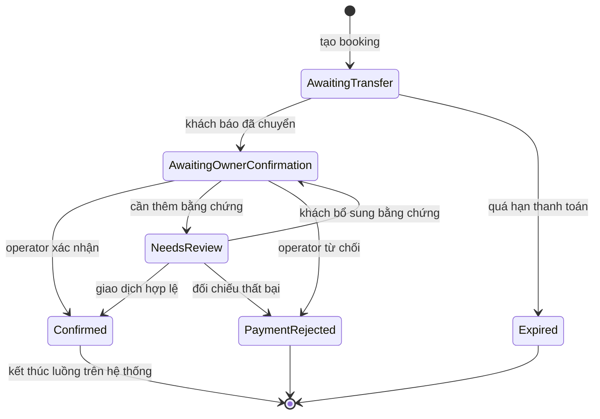

| Transition | Actor | Điều kiện | Tác động |
|---|---|---|---|
| Tạo → `AwaitingTransfer` | Customer/API | Court trống, quote hợp lệ và venue có QR nhận tiền hợp lệ | Tạo allocation, payment deadline và snapshot QR do chủ sân cung cấp |
| `AwaitingTransfer` → `AwaitingOwnerConfirmation` | Customer | Còn deadline | Lưu evidence, dừng auto-expiry và thông báo operator |
| `AwaitingTransfer` → `Expired` | Worker | Quá deadline, chưa report transfer | Giải phóng allocation |
| Chờ xác nhận → `Confirmed` | Operator | Đúng venue scope và đúng giao dịch | Payment `PAID`, lưu `confirmed_by/at` |
| Chờ xác nhận → `NeedsReview` | Operator | Cần đối chiếu thêm, có lý do | Giữ allocation, payment `NEEDS_REVIEW`, outbox tới customer |
| `NeedsReview` → Chờ xác nhận | Customer | Bổ sung evidence thuộc đơn mình | Payment `TRANSFER_REPORTED`, lưu thêm history, outbox tới owner; không áp dụng deadline cũ |
| Chờ xác nhận → `PaymentRejected` | Operator | Có lý do hợp lệ | Giải phóng allocation khi terminal |

`CONFIRMED` là trạng thái cuối của luồng booking thành công. Khách chỉ cần đến sân chơi theo lịch; mọi vấn đề sau xác nhận thanh toán được giải quyết trực tiếp với nhân viên tại sân. Không có check-in/check-out, trạng thái vắng mặt hoặc hoàn thành. Booking giữ trạng thái `CONFIRMED` sau giờ chơi; allocation vẫn bảo vệ khoảng thời gian đã đặt, không cần thao tác đóng booking.

## 2. Trạng thái Payment

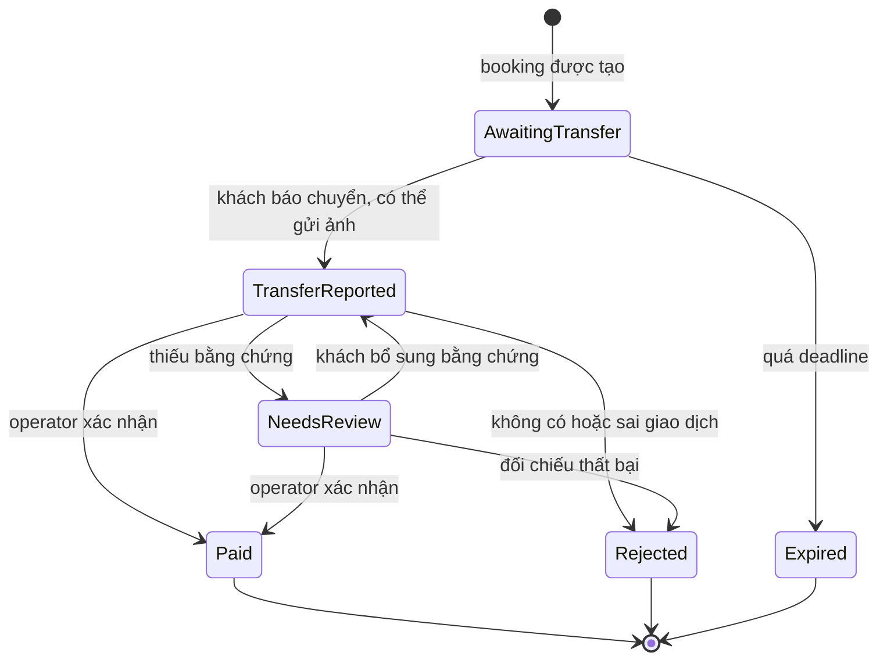

## 3. Trạng thái Booking Series

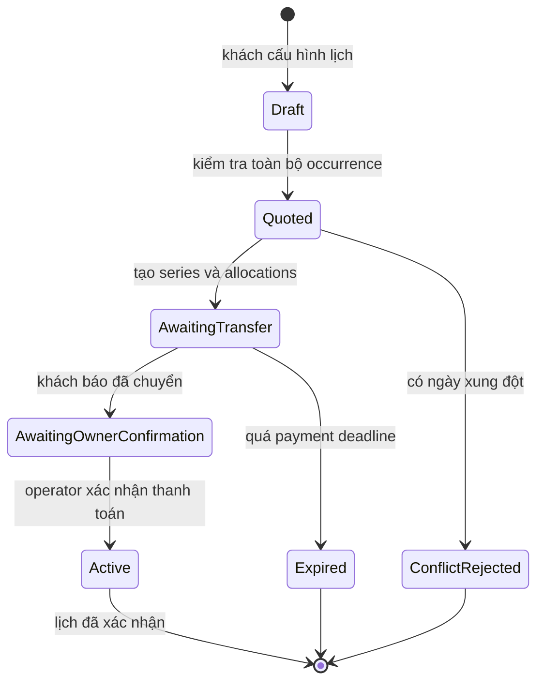

## 4. Trạng thái hồ sơ Cơ sở

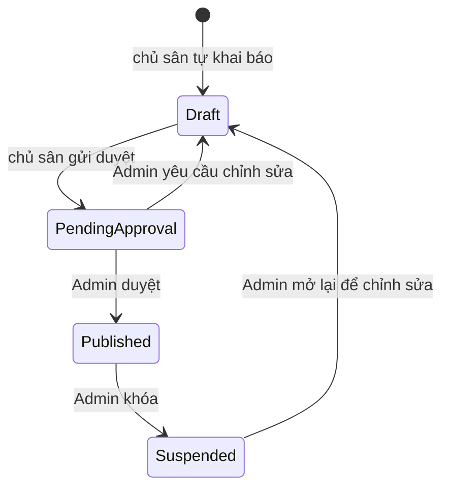

Tài khoản chủ sân được tạo ở `PENDING_ONBOARDING` và chỉ chuyển sang trạng thái vận hành đầy đủ khi hồ sơ đầu tiên được duyệt. Chỉ cơ sở `Published` và các sân `Active` mới xuất hiện trên `tenmien.vn`; operator không được tự chuyển cơ sở sang `Published`. Khi sửa địa chỉ, chủ sở hữu hoặc tài khoản nhận tiền của cơ sở đã publish, hệ thống tạo một bản revision chờ duyệt để dữ liệu đang hoạt động không biến mất ngay.

## 5. Trạng thái Sân

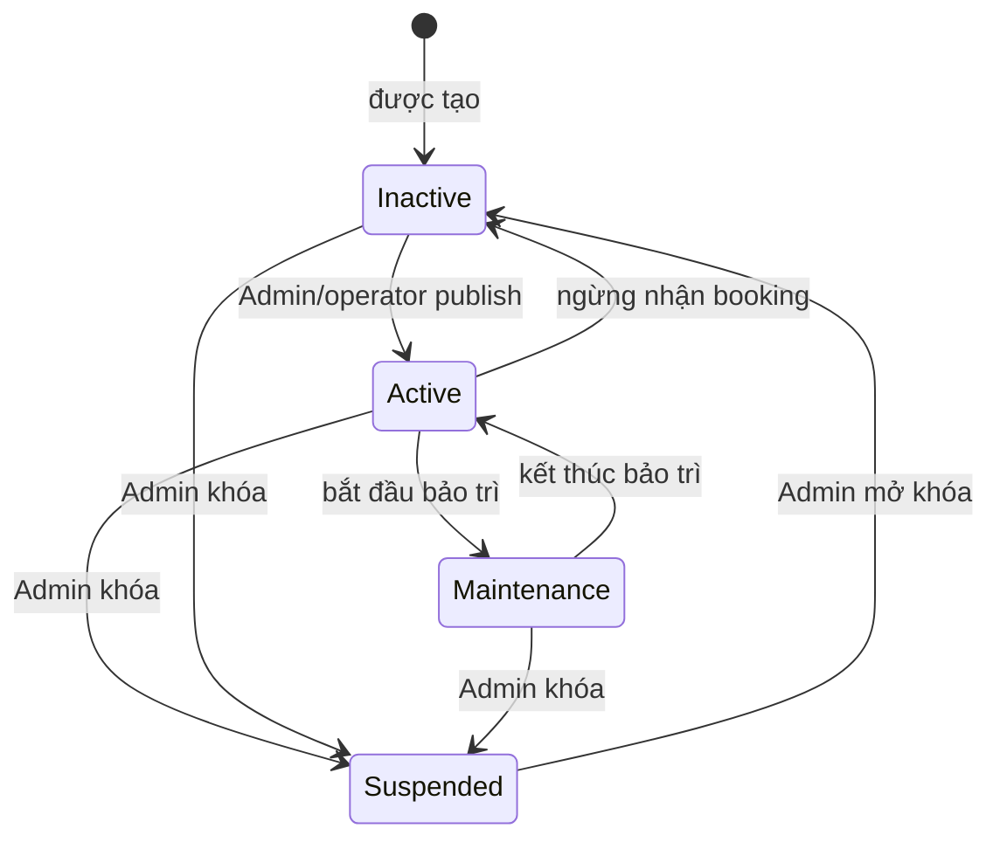

## 6. Đặt vãng lai và xác nhận thanh toán

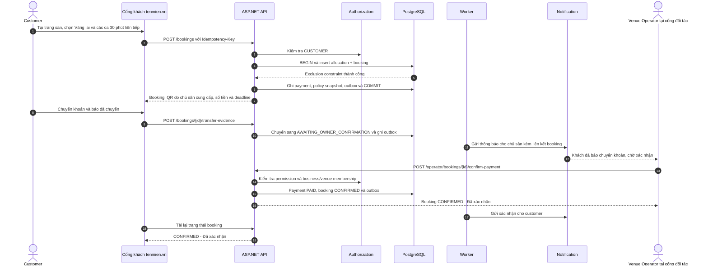

## 7. Hai khách đặt cùng một khung giờ

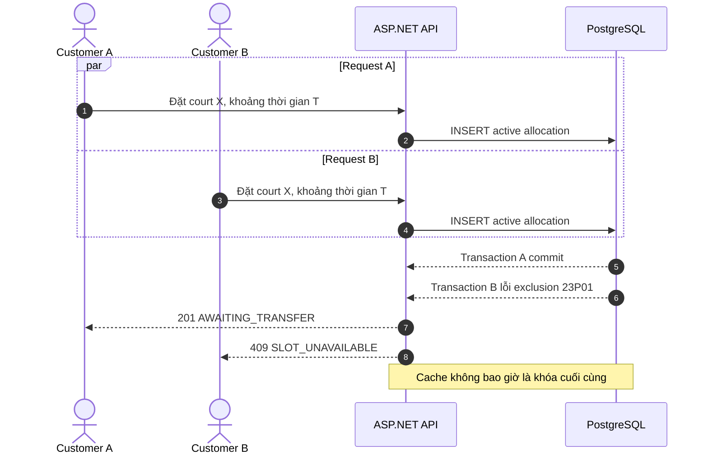

## 8. Tìm sân gần nhất

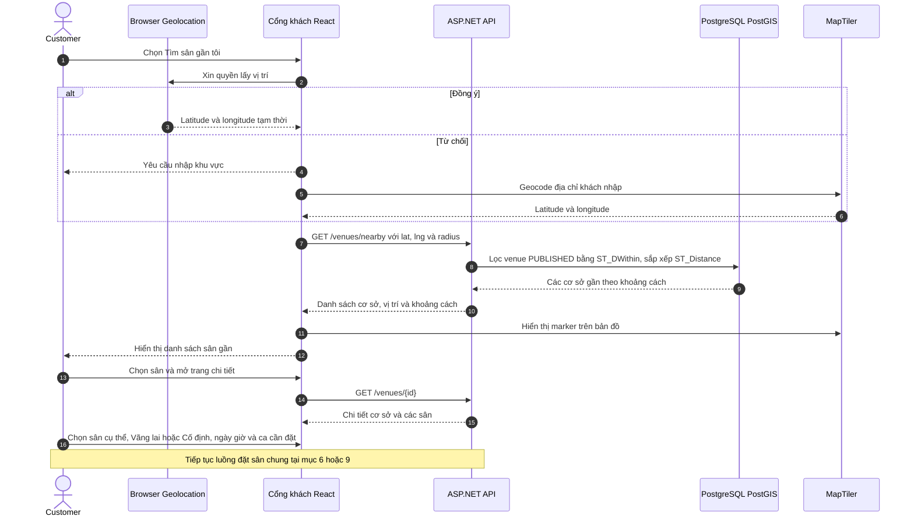

Nearby chỉ tìm theo vị trí, không nhận ngày/giờ/số ca, không kiểm tra availability hoặc tạo quote. Sau khi chọn sân, người dùng dùng cùng trang chi tiết và luồng đặt sân như mọi cách tìm sân khác; lịch trống và giá được kiểm tra theo lựa chọn đặt sân tại đó.

## 9. Tạo lịch thuê cố định

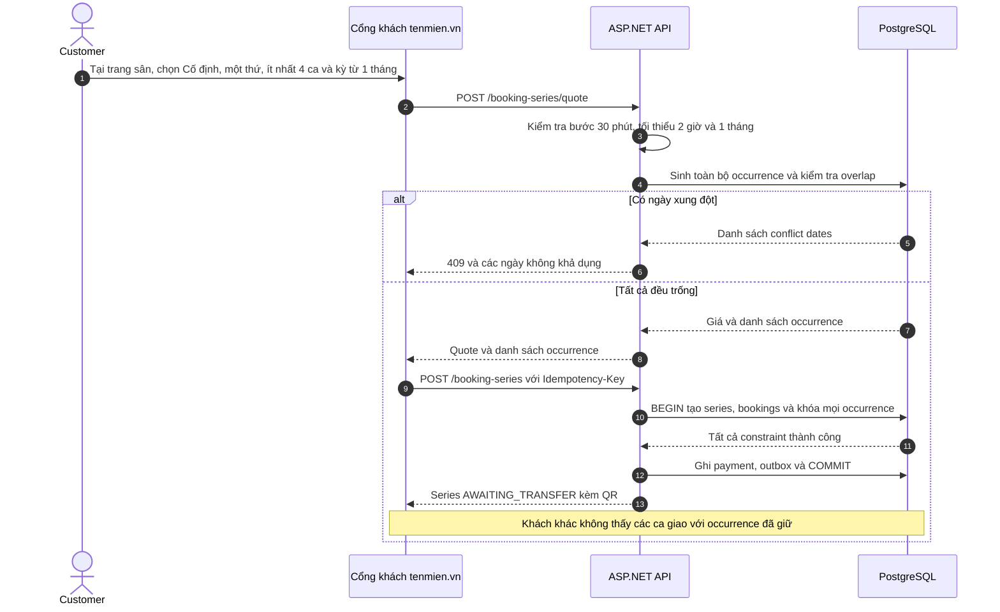

## 10. Booking hết hạn

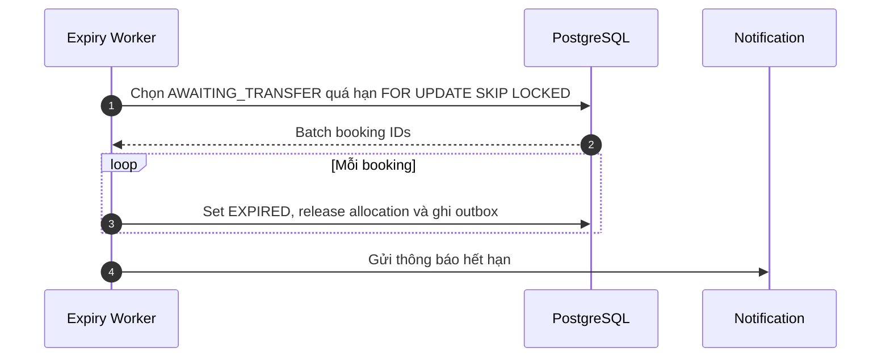

## 11. Operator từ chối hoặc yêu cầu kiểm tra

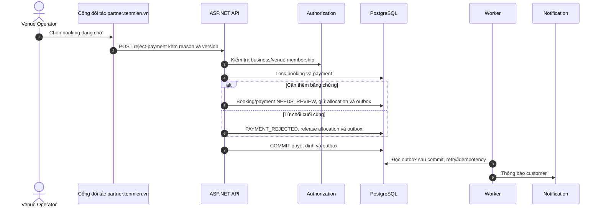

## 12. Upload QR hoặc biên lai bằng presigned URL

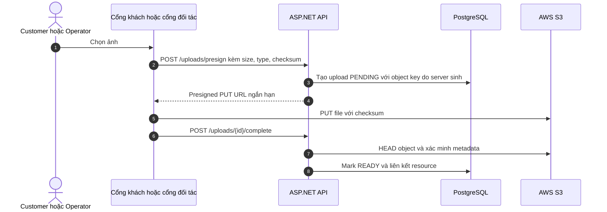
