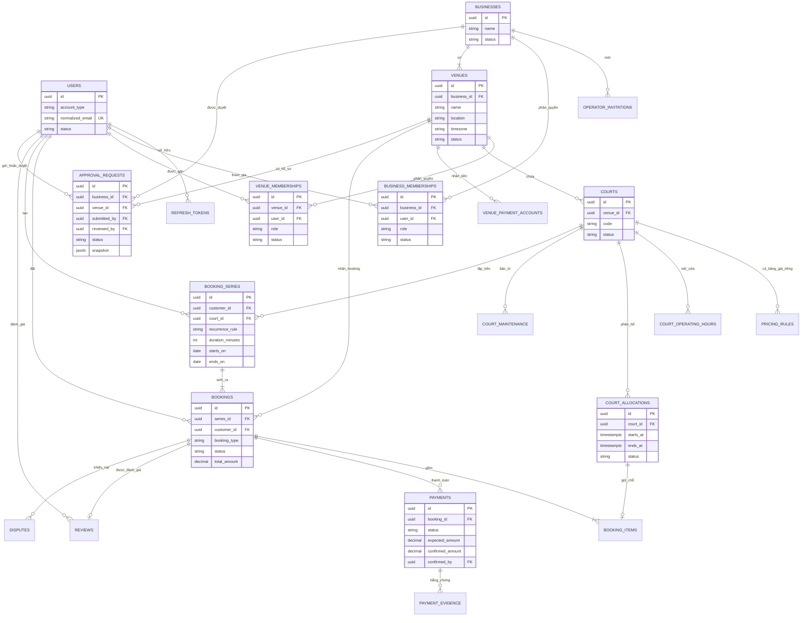
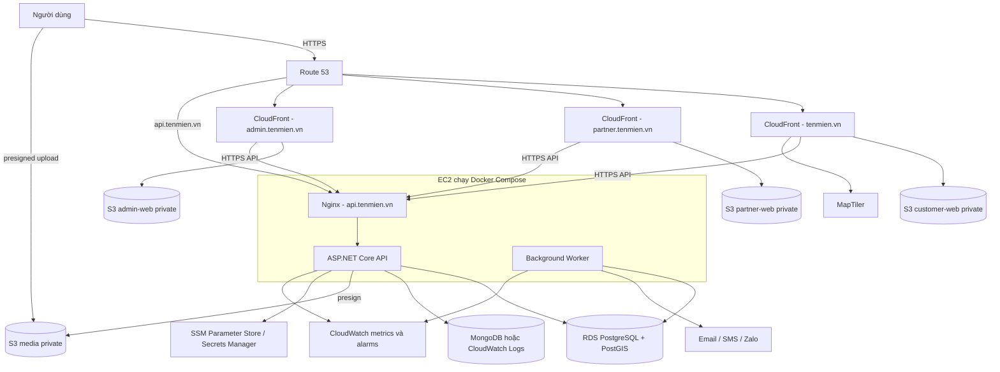
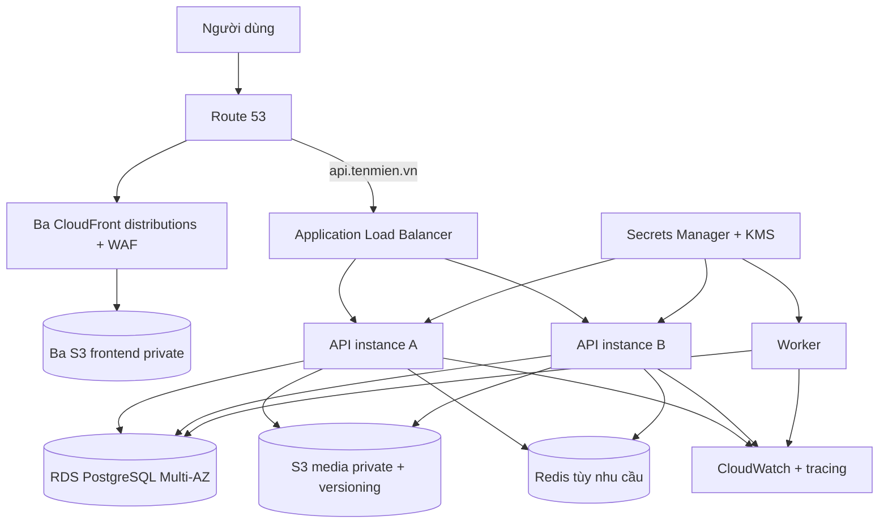

# Database và kiến trúc hệ thống

## 1. Quyết định lưu trữ

| Dữ liệu | Nơi lưu | Lý do |
|---|---|---|
| User, business, venue, court, pricing | PostgreSQL | Quan hệ rõ ràng, constraint và truy vấn nghiệp vụ |
| Booking, series, allocation | PostgreSQL | Transaction và exclusion constraint chống double booking |
| Payment và bằng chứng | PostgreSQL + S3 | Trạng thái tài chính nhất quán; ảnh để trong object storage |
| Audit nghiệp vụ | PostgreSQL append-only | Có thể truy vết và không phụ thuộc log kỹ thuật |
| Application log | MongoDB nếu bắt buộc | Schema linh hoạt, TTL retention; không phải source of truth |
| Ảnh sân, QR, biên lai | S3 private | Presigned URL, lifecycle và mã hóa |

Không nên lưu authoritative booking/order trong MongoDB. Việc tách booking sang MongoDB làm tăng rủi ro double booking, transaction liên database và báo cáo doanh thu khó kiểm soát.

## 2. Quy ước dữ liệu

- ID nghiệp vụ: UUIDv7.
- Phân cấp tài sản: `businesses` → `venues` → `courts`; không bỏ qua cấp doanh nghiệp.
- Tiền: `numeric(18,0)` và currency `VND`; không dùng `float`.
- Thời điểm: `timestamptz` lưu UTC.
- Venue lưu IANA timezone, mặc định `Asia/Ho_Chi_Minh`.
- Lịch giá và recurrence dùng local date/time của venue rồi chuyển sang UTC.
- Lịch sân dùng bước thời gian cố định 30 phút. `starts_at`, `ends_at` phải nằm trên biên ca và thời lượng phải là bội số của 30 phút.
- Không tạo sẵn một dòng database cho từng ca. Availability API sinh các ca từ giờ mở cửa rồi loại các khoảng giao với `court_allocations`; database chỉ lưu allocation liên tục để tránh phình dữ liệu.
- Email lưu thêm normalized lowercase; phone chuẩn E.164.
- Password, refresh token, OTP và invitation token chỉ lưu hash.
- Booking/payment không hard delete; thay đổi bằng state và audit.

## 3. Các bảng PostgreSQL chính

| Nhóm | Bảng | Mục đích |
|---|---|---|
| Identity | `users` | Tài khoản với một `account_type` |
| Identity | `refresh_tokens` | Refresh rotation và revoke family |
| Business | `businesses` | Đơn vị kinh doanh sở hữu một hoặc nhiều cơ sở |
| Operator | `operator_invitations` | Link mời nhân viên một lần do owner/Admin tạo, gắn với business và scope |
| Operator | `business_memberships` | Gán owner/manager và permission trên toàn doanh nghiệp |
| Operator | `venue_memberships` | Giới hạn operator vào một hoặc nhiều cơ sở cụ thể |
| Approval | `approval_requests` | Hồ sơ đăng ký/điều chỉnh gửi Admin duyệt, kèm snapshot và quyết định |
| Venue | `venues` | Cơ sở, địa chỉ, timezone và PostGIS location |
| Venue | `courts` | Các sân con trong venue |
| Venue | `court_operating_hours` | Giờ mở cửa theo ngày trong tuần |
| Venue | `court_maintenance` | Lịch bảo trì |
| Venue | `venue_images`, `amenities` | Ảnh và tiện ích |
| Payment setup | `venue_payment_accounts` | Ngân hàng, tên tài khoản và QR do chủ sân cung cấp cho cơ sở |
| Pricing | `pricing_rules` | Bảng giá do chủ sân cấu hình riêng cho từng court, theo ngày, khung giờ và độ ưu tiên |
| Availability | `court_allocations` | Nguồn khóa thời gian cho booking/maintenance |
| Booking | `booking_series` | Lịch cố định hàng tuần |
| Booking | `bookings` | Booking vãng lai hoặc occurrence |
| Booking | `booking_items` | Court, allocation và snapshot giá |
| Payment | `payments` | Số tiền kỳ vọng, trạng thái và người xác nhận |
| Payment | `payment_evidence` | Mã giao dịch và S3 object key của biên lai |
| Operation | `notifications`, `disputes`, `reviews` | Thông báo, khiếu nại và đánh giá |
| Reliability | `outbox_messages`, `idempotency_records` | Side effect đáng tin cậy và retry an toàn |
| Audit | `audit_events` | Lịch sử append-only |

## 4. Thuộc tính quan trọng

| Entity.Attribute | Kiểu | Quy tắc |
|---|---|---|
| `User.account_type` | enum | Customer endpoint tạo `CUSTOMER`; partner endpoint tạo `VENUE_OPERATOR`; client không truyền enum này |
| `User.status` | enum | Partner mới là `PENDING_ONBOARDING`; sau duyệt là `ACTIVE`; có thể `SUSPENDED` |
| `OperatorInvitation.token_hash` | text/bytea | Unique, one-time, có expiry |
| `Business.status` | enum | `DRAFT`, `PENDING_APPROVAL`, `ACTIVE`, `SUSPENDED` |
| `BusinessMembership.role` | enum | `OWNER`, `MANAGER`; scope toàn doanh nghiệp |
| `VenueMembership.role` | enum | `MANAGER`, `STAFF`; scope tại một cơ sở |
| `Venue.status` | enum | `DRAFT`, `PENDING_APPROVAL`, `PUBLISHED`, `SUSPENDED` |
| `ApprovalRequest.status` | enum | `PENDING`, `APPROVED`, `CHANGES_REQUESTED`, `REJECTED` |
| `Venue.location` | `geography(Point,4326)` | GiST index để tìm gần nhất |
| `Venue.timezone` | varchar | IANA timezone |
| `PricingRule.court_id` | uuid | Bắt buộc; giá thuộc một sân cụ thể do owner của doanh nghiệp sở hữu sân cấu hình |
| `PricingRule.starts_on/ends_on` | date | Khoảng ngày áp dụng bảng giá |
| `PricingRule.start_time/end_time` | time | Khung giờ địa phương của venue, thẳng hàng theo ca 30 phút |
| `PricingRule.price_per_slot` | numeric(18,0) | Giá VND cho một ca 30 phút; không âm |
| `PricingRule.priority` | integer | Chọn quy tắc ưu tiên cao nhất khi có nhiều quy tắc áp dụng; không cho phép quy tắc trùng phạm vi và cùng độ ưu tiên |
| `CourtAllocation.starts_at/ends_at` | timestamptz | Khoảng `[start,end)`, end > start |
| `CourtAllocation.status` | enum | `RESERVED`, `RELEASED`; booking đã xác nhận giữ `RESERVED` cho khoảng thời gian đã đặt |
| `Booking.booking_type` | enum | `CASUAL`, `RECURRING_OCCURRENCE` |
| `Booking.series_id` | uuid nullable | Có giá trị với occurrence của lịch cố định |
| `Booking.status` | enum | Theo booking state machine |
| `Booking.payment_deadline` | timestamptz | Chỉ auto-expire khi chưa report transfer |
| `Booking.version` | bigint | Optimistic concurrency |
| `BookingSeries.recurrence_rule` | jsonb | MVP chỉ cho schema weekly được kiểm soát |
| `BookingSeries.duration_minutes` | integer | Tối thiểu 120 và chia hết cho 30 |
| `BookingSeries.starts_on/ends_on` | date | `ends_on >= starts_on + 1 month`, đồng thời không vượt booking horizon |
| `BookingSeries.payment_plan` | enum | F07 đã duyệt chỉ `FULL_SERIES` (100% cả kỳ/một payment) |
| `Booking.payment_scope_id` | uuid non-null | `COALESCE(series_id,id)`; casual giữ scope=id |
| `Payment.payment_scope_id` | uuid non-null unique | Một payment mỗi scope; composite FK đến `(Booking.id,payment_scope_id)` bảo đảm anchor đúng nhóm |
| `Payment.recipient_snapshot` | jsonb | Snapshot ngân hàng, tài khoản nhận tiền và object key/version của QR do chủ sân cung cấp tại lúc tạo booking; giữ ảnh gốc trong thời gian lưu booking, không lưu presigned URL có hạn vào snapshot |
| `Payment.expected_amount` | numeric(18,0) | Bằng tổng tiền snapshot |
| `Payment.confirmed_amount` | numeric(18,0) | Operator nhập/đối chiếu |
| `Payment.confirmed_by/at` | uuid/timestamptz | Bắt buộc khi `PAID` |
| `PaymentEvidence.proof_object_key` | varchar | Object private trên S3 |

## 5. Chống double booking

Booking và maintenance đều phải tạo `court_allocations`. Constraint ở database là lớp bảo vệ cuối cùng:

```sql
CREATE EXTENSION IF NOT EXISTS btree_gist;

ALTER TABLE court_allocations
  ADD CONSTRAINT ck_allocation_interval
  CHECK (ends_at > starts_at);

ALTER TABLE court_allocations
  ADD CONSTRAINT ck_allocation_30_minute_grid
  CHECK (
    EXTRACT(SECOND FROM starts_at) = 0
    AND EXTRACT(SECOND FROM ends_at) = 0
    AND EXTRACT(MINUTE FROM starts_at) IN (0, 30)
    AND EXTRACT(MINUTE FROM ends_at) IN (0, 30)
    AND MOD(EXTRACT(EPOCH FROM (ends_at - starts_at))::bigint, 1800) = 0
  );

ALTER TABLE court_allocations
  ADD CONSTRAINT no_overlapping_active_allocations
  EXCLUDE USING gist (
    court_id WITH =,
    tstzrange(starts_at, ends_at, '[)') WITH &&
  )
  WHERE (status = 'RESERVED');
```

Khi PostgreSQL trả lỗi `23P01`, API map thành `409 SLOT_UNAVAILABLE`. Redis hoặc cache chỉ tăng tốc, không được dùng làm nguồn quyết định quyền sở hữu slot.

## 6. Tìm sân gần nhất với PostGIS

```sql
CREATE EXTENSION IF NOT EXISTS postgis;

CREATE INDEX ix_venues_location
  ON venues USING gist (location);

-- Lọc theo bán kính bằng ST_DWithin.
-- Sắp xếp theo khoảng cách bằng ST_Distance.
```

API nearby chỉ nhận lat/lng tạm thời và radius, trả các venue đã publish theo khoảng cách cùng thông tin cơ bản và vị trí. Không truy vấn allocation, tính availability hoặc tạo quote ở bước này. Sau khi khách chọn sân, trang chi tiết dùng luồng đặt sân chung để chọn Vãng lai/Cố định, ngày giờ và các ca; availability và giá được kiểm tra theo lựa chọn đó. Không lưu tọa độ chính xác của customer trong profile hoặc application log.

## 7. Transaction đặt sân

### Vãng lai

1. Kiểm tra idempotency key và request hash.
2. Kiểm tra start/end nằm trên biên ca 30 phút, các ca liên tiếp và thời lượng tối thiểu 30 phút.
3. Tính lại giá từng ca theo `pricing_rules` của court do chủ sân cấu hình trong transaction, rồi cộng tổng. Nếu có ca chưa được cấu hình giá thì không tạo quote/booking; không mặc định giá bằng 0. Lưu snapshot chi tiết giá để thay bảng giá sau đó không sửa tiền booking đã tạo.
4. Insert một allocation `RESERVED` bao phủ toàn bộ các ca đã chọn.
5. Insert booking, item, payment, outbox và idempotency record.
6. Commit; conflict ở bất kỳ ca nào map thành `409`.

### Cố định

1. Kiểm tra một khung giờ cố định có thời lượng tối thiểu 120 phút, chia hết cho 30 và kỳ thuê tối thiểu 1 tháng.
2. Sinh occurrences hàng tuần trên cùng court và khung giờ theo timezone venue.
3. Kiểm tra booking horizon và số lượng occurrence tối đa.
4. Insert series, toàn bộ bookings và allocations trong một transaction; các occurrence được giữ ngay khi transaction commit.
5. Một allocation conflict sẽ rollback toàn bộ và API trả các ngày/ca xung đột.
6. Nếu series hết hạn thanh toán trước khi khách báo chuyển khoản, Worker giải phóng toàn bộ allocations của series.
7. Với series rất dài, có thể chuyển sang rolling window sau MVP nhưng phải công bố rõ horizon được bảo đảm.

## 8. ERD rút gọn



## 9. MongoDB cho application log

MongoDB không phải source of truth. Collection đề xuất:

- `application_logs`: log kỹ thuật đã redact, TTL 30 ngày.
- `audit_export_logs`: bản sao phục vụ tìm kiếm, nhưng audit gốc vẫn ở PostgreSQL.

```javascript
db.application_logs.createIndex({ expireAt: 1 }, { expireAfterSeconds: 0 })
db.application_logs.createIndex({ traceId: 1, timestamp: -1 })
db.application_logs.createIndex({ service: 1, level: 1, timestamp: -1 })
```

Không ghi password, token, OTP, authorization header, số tài khoản đầy đủ, signed S3 URL, ảnh biên lai, email/phone đầy đủ hoặc dữ liệu thẻ.

## 10. Kiến trúc MVP



Ba frontend là ba bản build React độc lập trong cùng monorepo. Mỗi bản build được đưa lên một S3 private origin và phân phối qua CloudFront + ACM. EC2 chỉ chạy Nginx, API và Worker; PostgreSQL chạy trên RDS Single-AZ tối thiểu khi có giao dịch thật.

## 11. Kiến trúc production



Redis chỉ được thêm khi có số liệu chứng minh nhu cầu cache/rate limit phân tán; không thay thế exclusion constraint.

## 12. Bảo mật và vận hành AWS

- Route 53 quản lý bốn record; ACM cấp chứng chỉ cho domain gốc và các subdomain.
- Ba bucket frontend và bucket media đều bật S3 Block Public Access; CloudFront đọc frontend bằng Origin Access Control.
- Chỉ mở HTTPS; SSH qua SSM Session Manager hoặc giới hạn nghiêm ngặt.
- Database/Redis nằm private subnet và chỉ nhận traffic từ app security group.
- EC2/task dùng IAM role, không lưu AWS access key trong source.
- S3 Block Public Access, mã hóa at rest, prefix policy và presigned URL ngắn hạn.
- Kiểm tra content type, kích thước, checksum và metadata sau upload.
- RDS automated backup/PITR; S3 versioning/lifecycle; định kỳ diễn tập restore.
- Alert cho 5xx, latency, DB connection/storage, failed outbox, booking chờ xác nhận quá SLA, backup và chứng chỉ.
